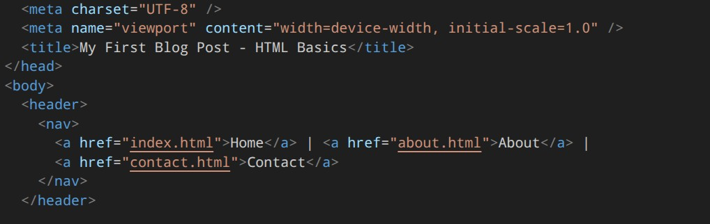

### Chapter 3 - Basic Media
#### a. Images (``)
The `` element is a crucial HTML element used to embed images into web pages. It's an empty element, meaning it doesn't have a closing tag, and its content is specified through various attributes.

##### 1. img Basic Syntax 
```

```

##### 2. img Essential Attributes
* src (Source) 
The src attribute specifies the path to the image file. This is the most important attribute for displaying images.

- Required: Yes
- Values: Can be a relative path, absolute URL, or data URI
- Supported formats: JPG, PNG, GIF, SVG, WebP, AVIF, etc.

  
```html
<!-- Relative path -->


<!-- Absolute URL -->


<!-- Data URI (inline image) -->

```

* alt (Alternative Text)
The alt attribute provides alternative text for an image if it cannot be displayed. This is crucial for accessibility and SEO.

* Required: Yes, for accessibility reasons
* Purpose: Describes the image content for screen readers, search engines, and when images fail to load
* Best practices: Be descriptive, concise, and relevant
```html
<!-- Descriptive alt text -->


<!-- Empty alt for decorative images -->


<!-- Important information in alt -->


```

##### 3. img Additional Common Attributes
* width and height
These attributes define the dimensions of the image in pixels.

- Purpose: Helps browsers allocate space before loading, preventing layout shifts
- Note: Should be used with caution as they can distort images if not proportional
```html

```

* title
Provides additional information about the image when hovering over it.

- Purpose: Shows tooltip text on mouseover
- Note: Not as important for accessibility but useful for user experience
```html

```

* loading
Controls how images are loaded (lazy loading).

- Values: auto, lazy, eager
- Purpose: Improves page performance by deferring non-critical image loading
  
```html

```

* srcset and sizes
Used for responsive images that adapt to different screen sizes and resolutions.

- srcset: Provides multiple image sources
- sizes: Defines the intended display size of the image in different scenarios
```html

```

* crossorigin
Controls how the browser handles cross-origin requests for images.

- Values: anonymous, use-credentials
- Purpose: Used for CORS (Cross-Origin Resource Sharing) handling
```html

```

* referrerpolicy
Controls what information is sent in the Referer header when fetching the image.

- values: no-referrer, origin, unsafe-url, etc.
  
```html

```

##### 4. Image Formats and Best Practices
* Modern Image Formats
WebP: Modern format with better compression than JPEG/PNG
AVIF: Next-generation format with excellent compression
SVG: Vector format, scalable without quality loss
JPEG: Best for photographs
PNG: Good for graphics with transparency

* Optimization Tips
1. Choose appropriate format: Use WebP or AVIF for modern browsers, JPEG/PNG for compatibility
2. Compress images: Reduce file size without sacrificing quality
3. Use responsive images: Implement srcset and sizes attributes
4. Lazy loading: Implement loading="lazy" for better performance
5. Accessibility: Always include descriptive alt text

##### 5. img Accessibility Considerations
1. Always provide alt text: Even decorative images should have empty alt="" attributes
2. Descriptive text: The alt text should describe what the image conveys
3. Context awareness: For complex images like charts or diagrams, provide detailed descriptions
4. Alternative content: Consider providing a text alternative for complex visual information
5. Screen reader compatibility: Ensure images are properly announced by screen readers

##### 6. img SEO Benefits
1. Image optimization: Proper alt attributes help search engines understand image content
2. File naming: Use descriptive file names that include relevant keywords
3. Structured data: Combine with schema.org markup for rich snippets
4. Page speed: Optimized images improve loading times and SEO rankings

##### 7. img Troubleshooting Common Issues
1. Broken images: Ensure correct file paths and permissions
2. Loading delays: Use lazy loading for better performance
3. Display issues: Specify width and height to prevent layout shifts
4. Accessibility problems: Always include descriptive alt text
5. Responsive issues: Implement srcset and sizes for different devices

##### 8. Project additions for the chapter
Here is the updated my-first-post.html file:
```html
<!DOCTYPE html>
<html lang="en">
<head>
    <meta charset="UTF-8">
    <meta name="viewport" content="width=device-width, initial-scale=1.0">
    <title>My First Blog Post - HTML Basics</title>
</head>
<body>

    <header>
        <nav>
            <a href="index.html">Home</a> | 
            <a href="about.html">About</a> | 
            <a href="contact.html">Contact</a>
        </nav>
    </header>

    <main>
        <h1>Getting Started with HTML</h1>
        <p>HTML is the foundation of the web. It's used to structure content and give it meaning. Here are some of the first elements you should learn to use.</p>

        <h2>Essential HTML Tags</h2>
        
        <ul>
            <li>`<h1>` for main headings</li>
            <li>`<p>` for paragraphs</li>
            <li>`<a>` for links</li>
            <li>`` for images</li>
        </ul>
        
        

        
        <h2>My Favorite Steps to a Great Blog Post</h2>
        
        <ol>
            <li>Outline your main points.</li>
            <li>Draft your content using headings and paragraphs.</li>
            <li>Add links to external resources or other pages.</li>
            <li>Review and edit your work for clarity.</li>
        </ol>

    </main>

    <footer>
        <p>Published: September 4, 2025</p>
    </footer>

</body>
</html>
```
You'll create a new image file (e.g., code-image.png). This is the media file that will be displayed on the page. 

The my-first-post.html file is updated to include the `` tag. This tag embeds the image into the blog post. It uses the src attribute to specify the location of the image file and the alt attribute to provide a text description for accessibility.


##### 9. img Questions
1. What is the purpose of the alt attribute in HTML images, and why is it important for accessibility?
2. How does the srcset attribute improve website performance and user experience compared to using a single image source?
3. What are the differences between width and height attributes versus CSS width/height properties when setting image dimensions?
4. Explain how lazy loading works with the loading="lazy" attribute and what benefits it provides.
5. What are the advantages of using modern image formats like WebP or AVIF over traditional JPEG/PNG formats?
6. How should you handle decorative images that don't convey meaningful information to users?
7. What is the difference between crossorigin="anonymous" and crossorigin="use-credentials" attributes when loading images?
8. Why is it important to specify both width and height attributes for images, and what problem do they solve?
9. How can you provide different image sources for different screen sizes using srcset and sizes attributes?
10. What are the SEO implications of proper image optimization, including the use of appropriate file formats and descriptive alt text?

