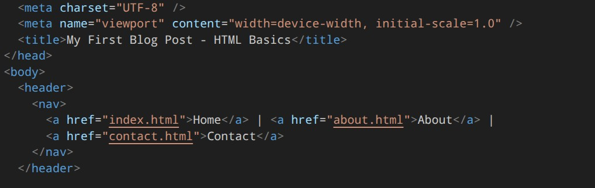

### Chapter 3 - Basic Media
# HTML v2
## Section 1. The Absolute Beginner: Foundational Concepts 👶

expand this with good details, talk about common used attributes for each one if exist, write as much you can. plus example and max 10 questions


source code -> https://github.com/kronosGR/Tutorials/tree/main/HTML/1
### Chapter 1 - HTML Core

#### What is HTML?

HTML (HyperText Markup Language) is the standard markup language used to create web pages. 
It defines the structure and content of a webpage by using a series of elements (also known as tags) that tell the browser how to display the information.
HTML is not a programming language but a markup language, meaning it uses tags to define elements within a document.

HTML documents are made up of elements such as headings, paragraphs, links, images, and more. 
These elements can be nested inside one another to create complex layouts. 
Every webpage on the internet has an HTML file that serves as its foundation. 
Without HTML, there would be no way to structure content for display on the web.

HTML is often used in conjunction with CSS (Cascading Style Sheets) for styling and JavaScript for interactivity. 
Together, they form the core technologies of the web.

#### Syntax

In HTML, every element is composed of three main components:

1. Opening Tag: This is where an element begins, denoted by a less-than sign (`<`) followed by the element name and optional attributes, ending with a greater-than sign (`>`).

For example:
   ```html
   <p>
   ```
Here, <p> is the opening tag for a paragraph.

2. Content: This is the actual text or other elements that appear between the opening and closing tags.

`<p>This is the content of the paragraph.</p>`
3. Closing Tag: This marks the end of an element, with a forward slash (/) before the element name. For example:

`</p>`
Closing tags are required for most elements in HTML.

Some elements, known as self-closing or void elements, do not have content and do not require closing tags.
Examples include  and <br>.

#### Attributes
Attributes are properties that provide additional information about an element. 
They are always specified in the opening tag of an element, usually in the format attribute="value". 

For example:
`<a href="https://www.example.com">Visit Example</a>`
In this case, href is an attribute with the value "https://www.example.com", which tells the browser where to navigate when the link is clicked.

Other common attributes include:
* src: Used in  tags to specify the image source.
* alt: Provides alternative text for images if they fail to load.
* class: Assigns a class name for CSS styling or JavaScript manipulation.
* id: Assigns a unique identifier for an element.

Attributes can also be used to control how elements behave or look on a page, such as setting the width of an image or making a button disabled.

#### HTML Intro - Example
```
<!DOCTYPE html>
<html lang="en">
<head>
    <meta charset="UTF-8">
    <meta name="viewport" content="width=device-width, initial-scale=1.0">
    <title>My First Blog Post</title>
</head>
<body>

    <h1>Hello, HTML!</h1>

    <p>This is my first blog post where I'm practicing my HTML skills. Every web page is built on HTML, which provides the essential structure for all of the content you see.</p>

    <p>I'm learning so much! To read more about my journey, <a href="about.html">click here to visit the about page</a>.</p>

    

    <p>You can also check out the official <a href="https://developer.mozilla.org/en-US/docs/Web/HTML" title="Visit the MDN Web Docs for HTML">MDN HTML documentation</a> for more information on the language.</p>

</body>
</html>
```

* The HTML code provided creates a single web page, likely for a blog post, by using fundamental HTML syntax and attributes.
It demonstrates how different elements are structured to form a complete, readable document.

* Document Structure
The code starts with `<!DOCTYPE html>`, which declares the document type as HTML5.
The entire page is contained within the `<html>` element, which has a lang="en" attribute to specify the language as English for accessibility and SEO.
The `<head>` section contains metadata not displayed on the page, such as the character set (`<meta charset="UTF-8">`) and the viewport settings (`<meta name="viewport"...>`) for responsive design.
The `<title>` tag sets the title that appears in the browser tab. The visible content of the page is all placed within the `<body>` element.

* Elements, Syntax, and Attributes
Within the body, the code uses various elements to structure content.
The `<h1>` tag defines the main heading of the page.
 This demonstrates the core HTML syntax of an opening tag (`<h1>`), content (Hello, HTML!), and a closing tag (`</h1>`).
The `<p>` tags are used for paragraphs of text, further illustrating this fundamental syntax.

The code also effectively uses attributes to add properties to elements. 
The `<a>` (anchor) tag creates a hyperlink, and its href attribute specifies the URL of the destination page, in this case, a file named about.html within the same project. 
The `` tag, a self-closing element, uses the src attribute to define the source of the image file and the alt attribute to provide a text description for screen readers or if the image fails to load. 
Finally, a title attribute on the second `<a>` tag provides extra information that appears as a tooltip when a user hovers over the link. 
The comments within the code (using ``) provide human-readable explanations of the purpose of each element.


#### HTML Core Questions
1. What does HTML stand for?
2. What are the three main parts of an HTML element?
3. Why are closing tags important in HTML?
4. Can all HTML elements be closed with a closing tag? Explain.
5. What is the purpose of attributes in HTML?
6. Give two examples of attributes and their usage.
7. How do you create a hyperlink in HTML using the `<a>` tag?
8. What is the difference between src and href attributes?
9. Why might you use an alt attribute in an image tag?
10. How do you define a paragraph in HTML?


---
### Chapter 2 - Essential Elements
#### a. Document Structure
##### 1. DOCTYPE html
source code - https://github.com/kronosGR/Tutorials/tree/main/HTML/2a

The document type declaration is an instruction that tells the web browser which version of HTML the page is written in. For HTML5, it's simply `<!DOCTYPE html>`. 
This declaration must be the very first line of an HTML document and is case-insensitive. 
It ensures that the browser renders the page in standards mode rather than quirks mode. 
While not an actual HTML element, it's crucial for proper page rendering and compatibility across different browsers.

The DOCTYPE declaration is essential because it tells the browser to use the modern HTML5 standard instead of legacy modes that might cause inconsistent rendering. 
Without it, some browsers may enter quirks mode where they try to emulate older browser behaviors.

Example:
```
<!DOCTYPE html>
<html>
<head><title>My Page</title></head>
<body><h1>Hello World</h1></body>
</html>
```

##### 2.  html
The root element of an HTML document. This is the parent element that contains all other elements in the page.
 Every HTML document must have one `<html>` element, and it should be the direct child of the document.
It's often called the "root" or "parent" element because all other elements are descendants of this element.

The `<html>` element can have several important attributes:
* lang: Specifies the primary language of the document content (e.g., lang="en" for English, lang="es" for Spanish)
* xml:lang: Specifies the language for XML documents (used in XHTML)
* dir: Specifies the text direction ("ltr" for left-to-right, "rtl" for right-to-left)
  
Example:
```
<html lang="en" dir="ltr">
  <head>
    <title>Page Title</title>
  </head>
  <body>
    <h1>Welcome to my website</h1>
    <p>This is a paragraph.</p>
  </body>
</html>
```

##### 3 head
The container for metadata about the document.
This section contains information about the page that is not visible to visitors, such as the title, character set, stylesheets, scripts, and other meta information.
Elements inside the `<head>` are not displayed on the web page itself but provide important information to browsers, search engines, and other web services.

Common attributes for elements within head:
* `<title>`: Contains the title of the document (shown in browser tab)
* `<meta>`: Provides metadata about the HTML document
	* charset: Specifies character encoding (e.g., charset="UTF-8")
	* name: Defines the type of metadata (description, keywords, author, viewport)
	* content: The value for the metadata defined by the name attribute
* `<link>`: Defines relationships between the document and external resources
	* rel: Relationship type (stylesheet, icon, canonical)
	* href: URL to the resource
	* type: MIME type of the linked resource
* `<script>`: Contains or references JavaScript code
	* src: URL to external script file
	* type: Type of script (usually "text/javascript")
	* async: Allows asynchronous loading
	* defer: Defers execution until page load
Example:
```
<head>
  <meta charset="UTF-8">
  <meta name="viewport" content="width=device-width, initial-scale=1.0">
  <meta name="description" content="This is a sample webpage about HTML">
  <meta name="keywords" content="HTML, web development, tutorial">
  <meta name="author" content="John Doe">
  <title>My Web Page</title>
  <link rel="stylesheet" href="styles.css">
  <link rel="icon" href="favicon.ico" type="image/x-icon">
  <script src="script.js" defer></script>
</head>
```

##### 4 body
The visible part of the document. This element contains all the content that users can see and interact with on a webpage, such as text, images, links, tables, forms, and other interactive elements.
Everything that appears in the browser window is placed within the `<body>` tags. It's the main content area of an HTML document.

The `<body>`  element can have attributes but are deprecated and should be avoided. Modern styling should be done using CSS instead.
* bgcolor: Sets background color (deprecated)
* text: Sets text color (deprecated)
* link: Sets link color (deprecated)
* vlink: Sets visited link color (deprecated)
* alink: Sets active link color (deprecated)


Example:
```
<body>
  <h1>Main Heading</h1>
  <p>This is visible content.</p>
  
  <a href="page.html">Link to another page</a>
  <div class="container">
    <p>More content here</p>
  </div>
</body>
```

##### 5. HTML Document Structure Questions
1. What is the purpose of the `<!DOCTYPE html>` declaration in an HTML document?
2. Which attribute should be used in the `<html>` element to specify the language of the document content?
3. What does the lang attribute in the `<html>` element help with for accessibility and SEO?
4. What are three important meta tags that should be included in the `<head>` section for proper web page optimization?
5. Which element contains the visible content of an HTML document that users can see and interact with?
6. What is the difference between a document type declaration and an HTML element?
7. Why is it important to include the viewport meta tag in the `<head>` section of a responsive webpage?
8. What are two deprecated attributes that were once used in the `<body>` element for styling purposes?
9. How do you specify the character encoding in an HTML document using the `<head>` section?
10. What is the significance of placing all metadata within the `<head>` section rather than the` <body>` section?

---

#### b. HTML Text and Headings
##### 1. Headings (h1 to h6)

source code - https://github.com/kronosGR/Tutorials/tree/main/HTML/2b


Headings in HTML are used to define the structure and hierarchy of content on a webpage. There are six heading levels, from `<h1>` (most important) to `<h6>` (least important). These headings should be used in a logical order to create a proper document outline that helps both users and search engines understand the content structure.

* Semantic Importance
The heading hierarchy is crucial for accessibility and SEO. Screen readers rely on this hierarchy to navigate through content, and search engines use it to understand the page's content organization. Each heading level should be used once per page in a logical sequence (h1 → h2 → h3 → etc.), though multiple H2s are acceptable.

* Common Attributes
	- id: Allows linking to specific sections of the page using anchor links
	- class: For CSS styling and JavaScript manipulation
	- title: Provides additional information on hover (though not widely used)
	- lang: Specifies language for internationalization
	- dir: Sets text direction (ltr or rtl)

Example
```
<h1>Primary Heading - Main Topic</h1>
<h2>Secondary Heading - Major Section</h2>
<h3>Tertiary Heading - Subsection</h3>
<h4>Fourth Level Heading</h4>
<h5>Fifth Level Heading</h5>
<h6>Sixth Level Heading</h6>

```

##### 2. Paragraphs (p)
Paragraphs are used to group blocks of text together. They represent a complete thought or idea and are typically rendered with spacing between them. The <p> element is a block-level element, meaning it starts on a new line and takes up the full width available.

* Common Attributes
	- class: For styling and JavaScript targeting
	- id: Unique identifier for linking or scripting
	- lang: Specifies language of content
	- dir: Sets text direction
	- align: Text alignment (deprecated, use CSS instead)
	- title: Tooltip text on hover

Example
```
<p>This is a paragraph of text that contains information about the topic.</p>
<p>Another paragraph with different content but same styling.</p>
```


##### 3. Hyperlinks (a)
Hyperlinks (anchors) are used to link to other web pages, sections within the same page, or external resources. They can be text-based, image-based, or any other HTML element. The <a>  tag is essential for navigation and creating a connected web experience.

* Required Attribute
	* href: Specifies the URL or destination of the link (required)

* Common Attributes
	- href: URL to link to (required)
	- title: Tooltip text that appears when hovering over the link
	- target: Where to open the linked document
		- _self: Opens in the same frame (default)
		- _blank: Opens in a new tab/window
		- _parent: Opens in the parent frame
		- _top: Opens in the full body of the window
 	- rel: Relationship between current and linked documents
		- noopener: Prevents the new page from accessing the original page's window object
		- noreferrer: Hides the referrer information
		- nofollow: Tells search engines not to follow the link
		- external: Indicates external links (not a standard but commonly used)
	- class: For styling purposes
	- id: Unique identifier for targeting
	- lang: Language of the linked content
	- dir: Text direction of the linked content
	- download: Forces download instead of navigation (HTML5)
	- ping: Specifies URLs to notify when the link is clicked (HTML5)

Example 
```
<a href="https://www.example.com">Visit Example Website</a>
<a href="#section1" title="Jump to section 1">Go to Section 1</a>
<a href="document.pdf" download>Download PDF Document</a>
<a href="mailto:email@example.com">Send Email</a>
<a href="page.html" target="_blank" rel="noopener noreferrer">Open in New Tab</a>

```

* Additional Link Types
	- Email links: href="mailto:email@example.com"
	- Phone links: href="tel:+1234567890"
	- Anchor links: href="#section-id" for internal page navigation
	- Relative links: href="page.html" (within the same site)
	- Absolute links: href="https://www.example.com/page.html"
 
* Considerations
	- Accessibility:
		- Use descriptive link text instead of generic phrases like "click here"
		- Include meaningful titles for links
		- Ensure links are distinguishable from surrounding text
		- Consider using ARIA labels for complex navigation
	- Styling:
	  CSS properties commonly used with links include:
	  	- color: Sets text color
		- text-decoration: Controls underlines and other decorations
		- font-weight: Makes links bold if needed
		- cursor: Changes cursor to pointer on hover
transition: Smooths hover effects
		  
##### 4. Project additions for chapter
```
<!DOCTYPE html>
<html lang="en">
<head>
    <meta charset="UTF-8">
    <meta name="viewport" content="width=device-width, initial-scale=1.0">
    <title>My Personal Blog</title>
</head>
<body>

    <h1>Welcome to My Blog</h1>

    <p>This is where I write about my journey in web development and other topics I'm passionate about. You can find all my latest posts below.</p>

    <h2>Latest Posts</h2>
    <ul>
        <li><a href="post1.html">A Quick Guide to HTML Basics</a></li>
        <li><a href="post2.html">Why Semantic HTML Matters</a></li>
        <li><a href="post3.html">Getting Started with Forms</a></li>
    </ul>

    <footer>
        <p>Copyright © 2025 My Blog</p>
    </footer>

</body>
</html>
```

* Headings and Paragraphs
The page uses `<h1>` to `<h3>` heading tags to structure its content and create a clear hierarchy. The `<h1>` tag defines the main title of the page ("A Quick Guide to HTML Basics"), which is the most important heading. Subsequent `<h2>` and `<h3>` tags are used for subheadings to logically break up the content into sections ("Organizing Your Content with Headings" and "Why Headings Matter"). This helps readers easily scan the page and understand the topic. The `<p>` tag is used for all the body text, organizing the content into readable paragraphs that are visually distinct from the headings. This separation makes the text easier to read and comprehend.

* Hyperlinks
The `<a>` (anchor) tag is used to create hyperlinks, which are essential for web navigation. The code includes two examples of `<a>` tags. The first links to an external website (https://developer.mozilla.org...) using the href attribute to specify the destination URL. It also has a target="_blank" attribute, which instructs the browser to open the link in a new browser tab. The second `<a>` tag links to an internal page (index.html) within the same blog project, allowing the user to navigate back to the homepage. These hyperlinks are what connect this blog post to the rest of the web, making it a functional part of the larger site.

##### 5. HTML Text and Heading Questions
1. What is the proper hierarchy for using HTML headings from most to least important?
2. Why should heading levels be used in a logical sequence rather than skipping levels?
3. What are three common attributes that can be applied to all heading elements (h1 through h6)?
4. How does the href attribute work differently for email links compared to web page links?
5. What is the purpose of the target="_blank" attribute in hyperlinks and what security consideration should be added with it?
6. Which attribute allows you to specify where a linked document should open when clicked?
7. What is the difference between using rel="noopener" and rel="noreferrer" with external links?
8. What are two deprecated attributes that were once used in paragraph elements for text alignment?
9. How do you create an anchor link that jumps to a specific section within the same page?
10. Why is it important to use descriptive link text instead of generic phrases like "click here"?


---
#### c. Lists
HTML lists are fundamental elements for organizing and presenting related information in a structured format. They provide semantic meaning to content by indicating that items belong together in a sequence or group. Lists are essential for creating readable, accessible, and well-structured web pages.

##### 1. Unordered Lists (`<ul>`)
An unordered list is used to present items that don't have a specific order or sequence. The browser typically displays these with bullet points, but the actual styling can be customized using CSS. The `<ul>` element is a block-level element that contains one or more `<li>` (list item) elements.

* Key Characteristics
	- Items are displayed with bullet points by default
	- No numerical ordering is implied
	- Can be nested within other list elements
	- Semantic meaning indicates related items in no particular order
 
* Common Attributes
	- class: For CSS styling and JavaScript targeting
	- id: Unique identifier for the list element
	- lang: Specifies language of content
	- dir: Sets text direction (ltr or rtl)
	- title: Tooltip text on hover
	- style: Inline CSS styling
	- data-*: Custom data attributes for JavaScript manipulation
 
Example

```
<ul>
    <li>First item in the list</li>
    <li>Second item in the list</li>
    <li>Third item in the list</li>
</ul>
```

##### 2. Ordered Lists (`<ol>`)
An ordered list is used when items have a specific sequence or ranking. The browser typically displays these with numbers, letters, or other markers depending on the type attribute. Like unordered lists, `<ol>` elements contain ` <li>` elements.

* Key Characteristics
	- Items are displayed with numbering or lettering
	- Implies a specific order or sequence
	- Can be nested within other list elements
	- Semantic meaning indicates related items in a particular order
 
* Common Attributes
	- class: For CSS styling and JavaScript targeting
	- id: Unique identifier for the list element
	- lang: Specifies language of content
	- dir: Sets text direction (ltr or rtl)
	- title: Tooltip text on hover
	- style: Inline CSS styling
	- type: Defines the numbering style
		- 1 for numbers (default)
		- A for uppercase letters
		- a for lowercase letters
		- I for uppercase Roman numerals
		- i for lowercase Roman numerals
	- start: Sets the starting number for the list
	- reversed: Creates a descending order list (HTML5)
	- data-*: Custom data attributes for JavaScript manipulation
 
Example
```
<ol>
    <li>First step in the process</li>
    <li>Second step in the process</li>
    <li>Third step in the process</li>
</ol>

<ol type="A" start="5">
    <li>Item 5</li>
    <li>Item 6</li>
    <li>Item 7</li>
</ol>

```

 ##### 3. List Items (`<li>`)
List items are the individual elements within both ordered and unordered lists. Each `<li>` element represents one item in the list structure.

* Key Characteristics
	- Must be direct children of `<ul>` or `<ol>` elements
	- Can contain any HTML content including other lists
	- Can be styled independently with CSS
	- Support for nesting within other list elements
 
* Common Attributes
	- class: For CSS styling and JavaScript targeting
	- id: Unique identifier for the list item
	- lang: Specifies language of content
	- dir: Sets text direction (ltr or rtl)
	- title: Tooltip text on hover
	- style: Inline CSS styling
	- value: Sets the value of an `<li>` element in an ordered list (HTML5)
	- data-*: Custom data attributes for JavaScript manipulation

Example
```
<ul>
    <li class="highlighted" id="first-item">First item with custom styling</li>
    <li title="This is a tooltip">Item with hover text</li>
    <li>Regular list item</li>
</ul>

<ol>
    <li value="10">Starting from number 10</li>
    <li>Next item</li>
    <li>Another item</li>
</ol>
```


##### 4. List Extras
* Nested Lists
Lists can be nested within each other to create complex hierarchical structures:
```
<ul>
    <li>First main item
        <ul>
            <li>Sub-item 1</li>
            <li>Sub-item 2
                <ol>
                    <li>Nested ordered item 1</li>
                    <li>Nested ordered item 2</li>
                </ol>
            </li>
        </ul>
    </li>
    <li>Second main item</li>
</ul>

```

* Lists Accessibility Considerations
For better accessibility:
	- Use semantic list elements to indicate relationships between items
	- Ensure nested lists are properly structured for screen readers
	- Include meaningful text within list items
	- Consider using ARIA roles if additional semantics are needed
	
* Best Practices
  	- Always use proper nesting - `<li>` elements must be direct children of `<ul>` or `<ol>`
	- Maintain logical order in ordered lists
	- Use appropriate list types for the content being presented
	- Combine lists with other HTML elements for complex layouts
	- Consider accessibility when creating lists
	- Use CSS for custom styling rather than relying on deprecated attributes
 
##### 5. Project additions for the chapter
* Updated index.html File
```html
<!DOCTYPE html>
<html lang="en">
<head>
    <meta charset="UTF-8">
    <meta name="viewport" content="width=device-width, initial-scale=1.0">
    <title>My Personal Blog</title>
</head>
<body>

    <h1>Welcome to My Blog</h1>

    <p>This is where I write about my web development journey. You can find all my latest posts below.</p>

    <h2>Latest Posts</h2>
    <ul>
        <li><a href="my-first-post.html">My First Blog Post - HTML Basics</a></li>
        <li><a href="post2.html">Why Semantic HTML Matters</a></li>
        <li><a href="post3.html">Getting Started with Forms</a></li>
    </ul>

    <footer>
        <p>Copyright © 2025 My Blog</p>
    </footer>

</body>
</html>
```
The new link is within the unordered list (`<ul>`), where a list item (`<li>`) now contains an anchor element (`<a>`). The href attribute is set to my-first-post.html, which is the filename of the new blog post. The text "My First Blog Post - HTML Basics" is the visible, clickable text for the link. This simple addition is what makes your site multi-page and navigable.

* Here is an updated HTML file, my-first-post.html,  for a blog post that now includes the lists. This code, for a file like my-first-post.html, would fit into the larger blog project.

```html
<!DOCTYPE html>
<html lang="en">
  <head>
    <meta charset="UTF-8" />
    <meta name="viewport" content="width=device-width, initial-scale=1.0" />
    <title>My First Blog Post - HTML Basics</title>
  </head>
  <body>
    <header>
      <nav>
        <a href="index.html">Home</a> | <a href="about.html">About</a> |
        <a href="contact.html">Contact</a>
      </nav>
    </header>

    <main>
      <h1>Getting Started with HTML</h1>
      <p>
        HTML is the foundation of the web. It's used to structure content and give it
        meaning. Here are some of the first elements you should learn to use.
      </p>

      <h2>Essential HTML Tags</h2>

      <ul>
        <li>h1 for main headings</li>
        <li>p for paragraphs</li>
        <li>a for links</li>
        <li>img for images</li>
      </ul>

      <h2>My Favorite Steps to a Great Blog Post</h2>

      <ol>
        <li>Outline your main points.</li>
        <li>Draft your content using headings and paragraphs.</li>
        <li>Add links to external resources or other pages.</li>
        <li>Review and edit your work for clarity.</li>
      </ol>
    </main>

    <footer>
      <p>Published: September 4, 2025</p>
    </footer>
  </body>
</html>

```

Explanation of Added Elements
In this updated blog post, I added two types of lists to demonstrate the concepts from Chapter 2c.

The first list is an unordered list, which is created using the `<ul>` tag. This type of list is used when the order of the items is not important. In this example, it presents a simple, bulleted list of essential HTML tags. Each item in the list is defined by an `<li>` (list item) tag, which is nested inside the `<ul>` container. The browser displays these as bullet points by default.

The second list is an ordered list, created using the `<ol>` tag. This list is used when the sequence or order of the items matters. In this case, it presents a step-by-step guide for creating a blog post. The `<li>` tags inside the `<ol> `container are automatically numbered by the browser, making it clear that these are sequential steps. This provides a clean way to present instructions or rankings to the user.

 
##### 6. HTML Lists Questions
1. What is the semantic difference between `<ul>` and `<ol>` elements, and when should each be used?
2. How does the type attribute affect ordered lists, and what are the different values it can accept?
3. Can list items (`<li>`) contain other HTML elements including nested lists? Provide an example.
4. What is the purpose of the start attribute in ordered lists, and how does it work?
5. How do you create a descending ordered list using HTML5 attributes?
6. What are three common attributes that can be applied to `<ul>` elements, and what are their purposes?
7. Why is proper nesting important when creating nested lists, and what happens if it's not followed correctly?
8. What are the accessibility considerations when working with HTML lists, particularly for screen readers?
9. How can you customize list styling using CSS, and what are some common approaches for removing default bullet points?
10. When would you use the value attribute in an ordered list `<li>` element, and what effect does it have on numbering?
 
---
### Chapter 3 - Basic Media
#### 3a. Images (``)
The `` element is a crucial HTML element used to embed images into web pages. It's an empty element, meaning it doesn't have a closing tag, and its content is specified through various attributes.

##### 1. img Basic Syntax 
```

```

##### 2. img Essential Attributes
* src (Source) 
The src attribute specifies the path to the image file. This is the most important attribute for displaying images.

- Required: Yes
- Values: Can be a relative path, absolute URL, or data URI
- Supported formats: JPG, PNG, GIF, SVG, WebP, AVIF, etc.

  
```html
<!-- Relative path -->


<!-- Absolute URL -->


<!-- Data URI (inline image) -->

```

* alt (Alternative Text)
The alt attribute provides alternative text for an image if it cannot be displayed. This is crucial for accessibility and SEO.

* Required: Yes, for accessibility reasons
* Purpose: Describes the image content for screen readers, search engines, and when images fail to load
* Best practices: Be descriptive, concise, and relevant
```html
<!-- Descriptive alt text -->


<!-- Empty alt for decorative images -->


<!-- Important information in alt -->


```

##### 3. img Additional Common Attributes
* width and height
These attributes define the dimensions of the image in pixels.

- Purpose: Helps browsers allocate space before loading, preventing layout shifts
- Note: Should be used with caution as they can distort images if not proportional
```html

```

* title
Provides additional information about the image when hovering over it.

- Purpose: Shows tooltip text on mouseover
- Note: Not as important for accessibility but useful for user experience
```html

```

* loading
Controls how images are loaded (lazy loading).

- Values: auto, lazy, eager
- Purpose: Improves page performance by deferring non-critical image loading
  
```html

```

* srcset and sizes
Used for responsive images that adapt to different screen sizes and resolutions.

- srcset: Provides multiple image sources
- sizes: Defines the intended display size of the image in different scenarios
```html

```

* crossorigin
Controls how the browser handles cross-origin requests for images.

- Values: anonymous, use-credentials
- Purpose: Used for CORS (Cross-Origin Resource Sharing) handling
```html

```

* referrerpolicy
Controls what information is sent in the Referer header when fetching the image.

- values: no-referrer, origin, unsafe-url, etc.
  
```html

```

##### 4. Image Formats and Best Practices
* Modern Image Formats
WebP: Modern format with better compression than JPEG/PNG
AVIF: Next-generation format with excellent compression
SVG: Vector format, scalable without quality loss
JPEG: Best for photographs
PNG: Good for graphics with transparency

* Optimization Tips
1. Choose appropriate format: Use WebP or AVIF for modern browsers, JPEG/PNG for compatibility
2. Compress images: Reduce file size without sacrificing quality
3. Use responsive images: Implement srcset and sizes attributes
4. Lazy loading: Implement loading="lazy" for better performance
5. Accessibility: Always include descriptive alt text

##### 5. img Accessibility Considerations
1. Always provide alt text: Even decorative images should have empty alt="" attributes
2. Descriptive text: The alt text should describe what the image conveys
3. Context awareness: For complex images like charts or diagrams, provide detailed descriptions
4. Alternative content: Consider providing a text alternative for complex visual information
5. Screen reader compatibility: Ensure images are properly announced by screen readers

##### 6. img SEO Benefits
1. Image optimization: Proper alt attributes help search engines understand image content
2. File naming: Use descriptive file names that include relevant keywords
3. Structured data: Combine with schema.org markup for rich snippets
4. Page speed: Optimized images improve loading times and SEO rankings

##### 7. img Troubleshooting Common Issues
1. Broken images: Ensure correct file paths and permissions
2. Loading delays: Use lazy loading for better performance
3. Display issues: Specify width and height to prevent layout shifts
4. Accessibility problems: Always include descriptive alt text
5. Responsive issues: Implement srcset and sizes for different devices

##### 8. Project additions for the chapter
Here is the updated my-first-post.html file:
```html
<!DOCTYPE html>
<html lang="en">
<head>
    <meta charset="UTF-8">
    <meta name="viewport" content="width=device-width, initial-scale=1.0">
    <title>My First Blog Post - HTML Basics</title>
</head>
<body>

    <header>
        <nav>
            <a href="index.html">Home</a> | 
            <a href="about.html">About</a> | 
            <a href="contact.html">Contact</a>
        </nav>
    </header>

    <main>
        <h1>Getting Started with HTML</h1>
        <p>HTML is the foundation of the web. It's used to structure content and give it meaning. Here are some of the first elements you should learn to use.</p>

        <h2>Essential HTML Tags</h2>
        
        <ul>
            <li>`<h1>` for main headings</li>
            <li>`<p>` for paragraphs</li>
            <li>`<a>` for links</li>
            <li>`` for images</li>
        </ul>
        
        

        
        <h2>My Favorite Steps to a Great Blog Post</h2>
        
        <ol>
            <li>Outline your main points.</li>
            <li>Draft your content using headings and paragraphs.</li>
            <li>Add links to external resources or other pages.</li>
            <li>Review and edit your work for clarity.</li>
        </ol>

    </main>

    <footer>
        <p>Published: September 4, 2025</p>
    </footer>

</body>
</html>
```
You'll create a new image file (e.g., code-image.png). This is the media file that will be displayed on the page. 

The my-first-post.html file is updated to include the `` tag. This tag embeds the image into the blog post. It uses the src attribute to specify the location of the image file and the alt attribute to provide a text description for accessibility.


##### 9. HTML Image element Questions
1. What is the purpose of the alt attribute in HTML images, and why is it important for accessibility?
2. How does the srcset attribute improve website performance and user experience compared to using a single image source?
3. What are the differences between width and height attributes versus CSS width/height properties when setting image dimensions?
4. Explain how lazy loading works with the loading="lazy" attribute and what benefits it provides.
5. What are the advantages of using modern image formats like WebP or AVIF over traditional JPEG/PNG formats?
6. How should you handle decorative images that don't convey meaningful information to users?
7. What is the difference between crossorigin="anonymous" and crossorigin="use-credentials" attributes when loading images?
8. Why is it important to specify both width and height attributes for images, and what problem do they solve?
9. How can you provide different image sources for different screen sizes using srcset and sizes attributes?
10. What are the SEO implications of proper image optimization, including the use of appropriate file formats and descriptive alt text?


---
#### 3b. Video  (`<video>`): For embedding video files.
##### 1. What is the `<video>` Element?
The `<video>` element is an HTML5 semantic element used to embed video content directly into web pages without requiring third-party plugins like Flash. It provides a standardized way to display videos that works across all modern browsers.

* Basic Syntax and Structure
  
```html
<video width="320" height="240" controls>
  <source src="movie.mp4" type="video/mp4">
  <source src="movie.ogg" type="video/ogg">
  Your browser does not support the video tag.
</video>
```

##### 2. Video Common Attributes
###### Essential Attributes
* src
Specifies the URL of the video file to embed.
```html
<video src="example.mp4"></video>
```

* controls
Displays video controls (play, pause, volume, etc.) for the user.
```html
<video src="movie.mp4" controls></video>
```

* width and height
Sets the dimensions of the video player.
```html
<video src="movie.mp4" width="640" height="480"></video>
```

###### Media Control Attributes
* autoplay
Specifies that the video should start playing as soon as it is ready.
```html
<video src="movie.mp4" autoplay></video>
```

* loop
Specifies that the video should loop when it reaches the end.
```html
<video src="movie.mp4" loop></video>
```

* muted
Specifies that the audio output of the video should be muted.
```html
<video src="movie.mp4" muted></video>
```

* preload
Specifies if and how the author thinks the video should be loaded when the page loads.

Values:
	- auto: Load the entire video
	- metadata: Load only metadata (like duration, dimensions)
	- none: Do not load the video
```html	
<video src="movie.mp4" preload="metadata"></video>
```

###### Advanced Attributes
* poster
Specifies an image to be shown while the video is downloading, or until the user hits the play button.
```html
<video src="movie.mp4" poster="thumbnail.jpg"></video>
```

* playsinline
For iOS Safari, this attribute allows videos to play inline instead of fullscreen.
```html
<video src="movie.mp4" playsinline></video>
```

##### 3.  Multiple Video Sources
The `<video>` element supports multiple `<source>` elements to provide different video formats for compatibility:

```html
<video width="320" height="240" controls>
  <source src="movie.mp4" type="video/mp4">
  <source src="movie.ogg" type="video/ogg">
  <source src="movie.webm" type="video/webm">
  Your browser does not support the video tag.
</video>
```

##### 4. Video Format Support
Common Video Formats:
1. MP4 - Most widely supported, especially with H.264 codec
2. WebM - Open format, good for Chrome and Firefox
3. Ogg - Open format, supported by Firefox and Opera
4. MOV - Apple's format, less common

* Browser Support Matrix
  
```
Format	Chrome	Firefox	Safari	Edge
MP4		✓		✓		✓		✓
WebM	✓		✓		✗		✓
Ogg		✗		✓		✗		✗
```

##### 5. Video Element Events
The `<video>` element supports various JavaScript events for interactive control:
- loadstart: When loading of the video starts
- canplay: When enough data is available to start playing
- playing: When video starts playing
- pause: When video is paused
- ended: When video reaches the end
- error: When an error occurs

##### 6. Accessibility Considerations
Provide captions: Use `<track>` element for subtitles
Descriptive text: Include alternative content for screen readers
Keyboard navigation: Ensure controls are accessible via keyboard
```html
<video controls>
  <source src="movie.mp4" type="video/mp4">
  <track kind="captions" src="captions.vtt" srclang="en" label="English">
  Your browser does not support the video tag.
</video>
```

##### 7. SEO Benefits
1. Structured data: Use schema.org markup for videos
2. Descriptive metadata: Include relevant keywords in video titles and descriptions
3. Fast loading: Properly optimized videos improve page speed scores

##### 8. Performance Optimization Tips
1. Choose appropriate formats: MP4 for broad compatibility, WebM for modern browsers
2. Compress videos: Reduce file sizes without sacrificing quality
3. Use responsive design: Make videos adapt to different screen sizes
4. Implement lazy loading: Load videos only when needed
5. Provide multiple resolutions: Offer different quality versions

##### 9. Common Use Cases
1. Product demonstrations: Show products in action
2. Tutorials and how-tos: Educational content
3. Marketing videos: Promotional material for businesses
4. Live streaming: Real-time video content
5. Background videos: Decorative video backgrounds (use carefully)

##### 10. Browser Compatibility
The `<video>` element is supported in all modern browsers:

- Chrome 4+
- Firefox 3.5+
- Safari 4+
- Internet Explorer 9+
- Edge 12+

##### 11. Troubleshooting Common Issues
1. Video not playing: Check file paths and formats
2. Autoplay blocked: Most browsers block autoplay with sound
3. Mobile compatibility: Use playsinline for iOS devices
4. Cross-origin issues: Handle CORS properly for external videos
5. Performance problems: Optimize video files and use appropriate preload settings

##### 12. Project additions for the chapter
To include a video in your project, you'll need to create a new video file and update the my-first-post.html file.

```html
 <video width="640" height="360" controls>
        <source src="video1" type="video/mp4" />
        Your browser does not support the video tag.
      </video>
```
File Changed: The my-first-post.html file is updated to include the `<video>` element, which embeds the video into the blog post. This tag uses the src attribute to specify the video file's location. The controls attribute is added to provide a play/pause button, volume control, and other standard video player functions.

##### 13. Questions
1. What are the main advantages of using the HTML5 `<video>` element over older Flash-based video embedding methods?
2. How does the preload attribute affect website performance, and when would you choose each preload value?
3. Explain how to provide multiple video formats for maximum browser compatibility and what the `<source>` element's role is in this process.
4. What are the differences between using autoplay, loop, and muted attributes together, and why is the muted attribute often required for autoplay to work?
5. How can you ensure that videos load efficiently while maintaining good user experience, considering both performance and accessibility?
6. What is the purpose of the poster attribute, and how does it improve the user experience when loading videos?
7. Describe the differences between MP4, WebM, and Ogg video formats in terms of browser support and use cases.
8. How can you make videos accessible to users with disabilities, including those who rely on screen readers or have hearing impairments?
9. What are some best practices for optimizing video files for web delivery, including compression techniques and file size considerations?
10. How do modern browsers handle autoplay policies, and what strategies can developers use to work within these restrictions while still providing engaging video content?


----
#### 3c.  Audio (`<audio>`)  For embedding audio files.

---
### Chapter 4 - Form Elements
* `<form>`: The container for all form elements.
* `<input>`: A versatile element for text, passwords, and more.
* `<label>`: To provide a descriptive label for a form control.

***

## Section 2. The Intermediate: Structure and Semantics ✍️

### Chapter 5 - Semantic HTML
* **The "Why":** Understand the importance of using the right tag for the right content.
* **Core Semantic Tags:**
    * `<header>`: For introductory content or navigation links.
    * `<nav>`: For major navigation blocks.
    * `<main>`: The main content of the document.
    * `<article>`: An independent, self-contained piece of content.
    * `<section>`: A grouping of related content.
    * `<footer>`: The bottom section of a document.

***
### Chapter 6 - Advanced Text Formatting
* `<strong>` and `<em>`: For semantically marking important or emphasized text.
* `<blockquote>`: For quoting content from another source.
* `<code>`: For displaying snippets of code.

***
### Chapter 7 -Tables
* `<table>`: The container for a table.
* `<thead>`, `<tbody>`, `<tfoot>`: Semantic grouping for table rows.
* `<tr>`, `<th>`, `<td>`: Table rows, headers, and data cells.

***
### Chapter 8 - Forms (Advanced)
* `<textarea>`: For multi-line text input.
* `<select>` and `<option>`: For dropdown lists.
* `<fieldset>` and `<legend>`: For grouping related form controls.

***

## Section 3. The Advanced: Modern Features & Best Practices 🛠️

### Chapter 9 - HTML5 & Modern Features
* **New Input Types:** Explore `type="email"`, `type="date"`, `type="url"`, and `type="search"`.
* **Canvas & SVG:**
    * `<canvas>`: For dynamic graphics and animations using JavaScript.
    * `<svg>`: For scalable vector graphics.
* **Semantic Multimedia:**
    * `<figure>` and `<figcaption>`: To associate a caption with an image or other media.

***
### Chapter 10 - Accessibility (a11y)
* **Why it Matters:** Understand the importance of making websites usable for everyone.
* **Best Practices:**
    * **ARIA Attributes:** Learn about `aria-label` and other attributes to improve screen reader support.
    * **Keyboard Navigation:** Ensure all interactive elements are accessible via the keyboard.

***
### Chapter 11 - SEO (Search Engine Optimization)
* **Metadata:** Understand the importance of the `<title>` tag and `<meta>` tags for search engines and social media previews.
* **Semantic Structure:** Learn how proper HTML structure helps search engines understand your content.

***
### Chapter 12 - Tools & Validation
* **Browser DevTools:** Use your browser's developer tools to inspect and debug HTML.
* **W3C Validator:** Learn to use online tools to validate your HTML and catch errors.

***

## Section 4. The Master: Ecosystem & Contributions 🎓

### Chapter 12 - Interoperability
* **HTML + CSS:** Master how to link and apply Cascading Style Sheets to style your HTML.
* **HTML + JavaScript:** Understand how JavaScript interacts with the **Document Object Model (DOM)** to manipulate HTML content dynamically.

***
### Chapter 12 - HTML Templating Engines
* **Concept:** Explore how to use templating engines like Handlebars, Pug, or EJS to generate dynamic HTML content from data.

***
### Chapter 12 - The Web Standards Process
* **W3C & WHATWG:** Understand the role of these organizations in defining and evolving the HTML standard.
* **Spec Reading:** Learn how to read and interpret the official HTML specification.

***
### Chapter 12 - Contribution
* **Open Source:** Contribute to open-source HTML projects.
* **Documentation:** Write or update documentation for HTML libraries or frameworks.
```